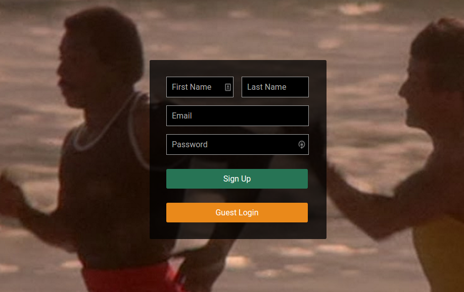
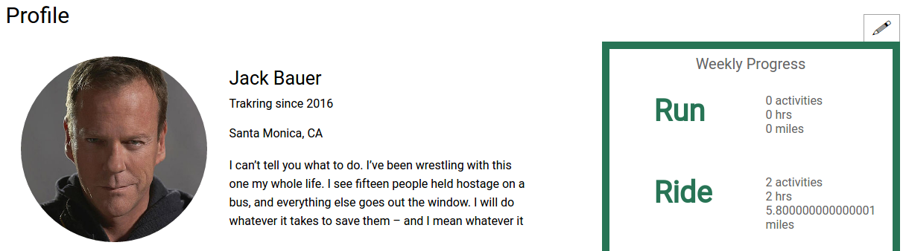
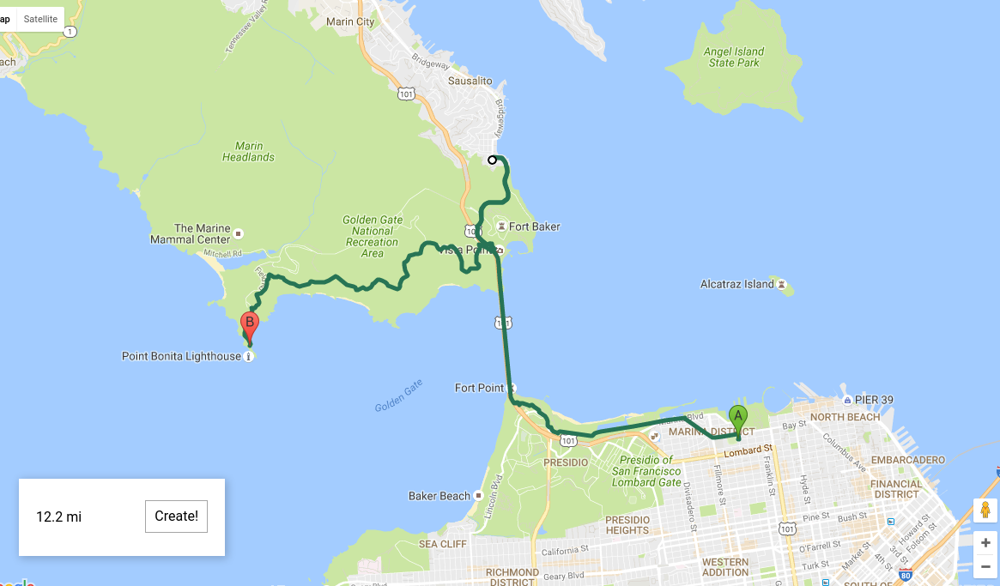
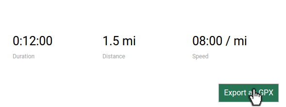
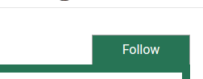

# [trakr][live]

![trakr header image][header_img]

[trakr live][live]

**trakr** is a single-page, full-stack web application inspired by [Strava][strava] and built with Ruby on Rails and PostgreSQL on the backend, React.js using Flux framework for the frontend, and enhanced by the Google Maps API.


## Features

trakr is a robust activity "trakking" application which allows a logged-in user to create and view their activities as well as those of other users. A user can follow another user to see their recent activity in their homepage feed.


### User Login and Authentication



Upon initially visiting the site, a potential user is prompted to sign up with their name, email and password. Their password is encrypted using the `bcrypt` gem and stored in the database (no unencrypted passwords here!). When a user signs up or logs in, a new session is created to preserve their state. This is done by creating a unique session token which is given to the user in the form of a cookie and also attached to their record in the database. When a user logs out, their cookie is cleared and their session cookie in the db is reset. When the user logs in again, their inputted password is encrypted and checked against the stored encrypted password.

Encrypting user's password:
```ruby
# user.rb
# save as instance variable to allow for length validation on `create`
attr_reader :password  

def password=(password)
  @password = password
  self.password_digest = BCrypt::Password.create(password)
end
```

Checking user password on login:
```ruby
# user.rb
def is_password?(password)
  # re-encrypts given `password` and checks against encrypted password_digest
  BCrypt::Password.new(password_digest).is_password?(password)
end
```

#### Users



After creating an account, users can visit their profile to update their profile information. This consists of their first name, last name, location and a short bio.

### Maps Everywhere!

The Google Maps API was instrumental in allowing the manual creation and display of activity routes.
To create a new activity, users can click on the "+" in the navbar. This takes them to the map creator, where they can create a route.

#### User Generated Routes



Activity creation uses the Google Maps JS API to render the map, markers and polyline. Users are met with a blank map (defaulting to the location set in their profile if they have one). Clicking on the map adds points which are linked via a single route provided by the Google Directions Service when given the set of markers.

The map creator is a single react component component with a local instance variable keeping track of the route's origin, destination and waypoints.

Clicking on the map triggers a map click event handler, which tells the Directions Service how to proceed.

The initial click on the map renders a single marker. This is just a placeholder as Google Directions Service requires an origin, destination and (optionally) a set of waypoints. The latlng of the marker are stored locally.

The second click creates a destination and requests a route from the Directions Service. This is rendered on the map and the initial marker is removed.

Subsequent map clicks are handled by pushing the current destination point into an array of waypoints and setting the destination to the clicked latlng.

The map click handling function:
```javascript
// activity_creation_map.jsx
_handleClick(e) {

  // only one point, no route yet
  if (!this.origin) {

    this.origin = e.latLng;

    this.marker = new google.maps.Marker({
      position: {
        lat: e.latLng.lat(),
        lng: e.latLng.lng()
      },
      map: this.map,
      title: "Start"
    });
  }
  // origin and destination make a route
  else {
    // set as click event (prevents full resync of route points)
    _draggedNotClicked = false;

    // clear the marker
    this.marker.setMap(null);

    // get directions & generate route request
    if (this.destination) {
      this.waypoints.push(this.destination);
    }
    this.destination = e.latLng;

    // make the request and pass callback
    this.routeService.route(this.directionsRequest(), (response, status) => {
      if (status === 'OK') {
        this.routeDisplay.setDirections(response);
      }
    });
  }
}

// associated helper
directionsRequest() {
  // create request
  return {
    origin: this.origin,
    destination: this.destination,
    waypoints: this.waypoints.map((waypoint) => {
      return {
        location: waypoint,
        stopover: false
      };
    }),
    travelMode: google.maps.TravelMode.WALKING
  };
}
```

The route is also draggable, which means the user can insert a waypoint in the middle of the route. This triggers a recalculation of distance and updates the local instance variables.

When a user is done creating their route, they click the "Create" button and are brought to a form, where they can review the map and enter additional information.

#### GPX File Export



Upon initialization in rails, each activity instance is passed the steps generated by Google Directions service. These differ from the waypoints given by the user in that there are many more steps (each is correlated with a change in direction) and are therefore useful outside the scope of Google routing. A .gpx file is generated using the `gpx` gem and saved as a Ruby `Tempfile` before being saved to the gpx activity attribute. On `Activity#save` the gpx file is uploaded to Amazon Web Services, where it can be retrieved by the user for later user.

```ruby
# activity.rb
def determine_properties
  # convert distance to km for gpx compatibility
  gpx = GPX::GPXFile.new(
    name: self.title,
    distance: self.distance * 1.60934,
    moving_duration: self.duration
  )
  gpx.tracks << GPX::Track.new
  gpx.tracks[0].segments << GPX::Segment.new

  # add trackpoints to gpx instance
  points = []
  @route.each do |point|
    points << GPX::TrackPoint.new(lat: point["lat"].to_f, lon: point["lng"].to_f)
  end
  gpx.tracks[0].segments[0].points = points

  # create temp file to save to paperclip (StringIO creates incorrect content type)
  tmp = Tempfile.new(['tmp', ".gpx"])
  tmp.write(gpx.to_s)
  tmp.rewind

  # update gpx properties
  self.speed = gpx.average_speed(units: "miles")
  self.gpx = tmp
end
```

#### Activities

Activities can be viewed in a number of locations. They are listed in the dashboard, profile and training pages, which provides links to the detail view. Detail views displays the map, user inputted info (title, description) and stats (distance, duration, pace).

### Staying Social

A user can view other users profiles from the 'Explore' page. Here they can see the user's info and recent activities. They can also follow or unfollow them.

#### Follows and the Dashboard



Following a user adds their recent activities to a user's dashboard. When the first visit the site they are brought to their dashboard, where they can view recent activities that may interest them and also get a snapshot of their weekly activity.

### It's a Single-Page App!

Using React.js and the flux framework, the page utilizes API calls to a remote server on nearly every user interaction.


[live]: http://trakr.cc
[strava]: http://strava.com
[header_img]: docs/images/header.png
[login_img]: docs/images/login.png
